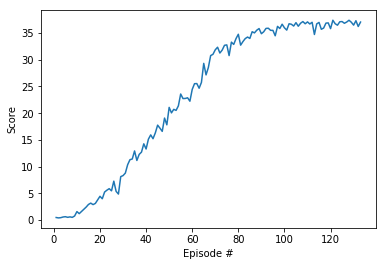
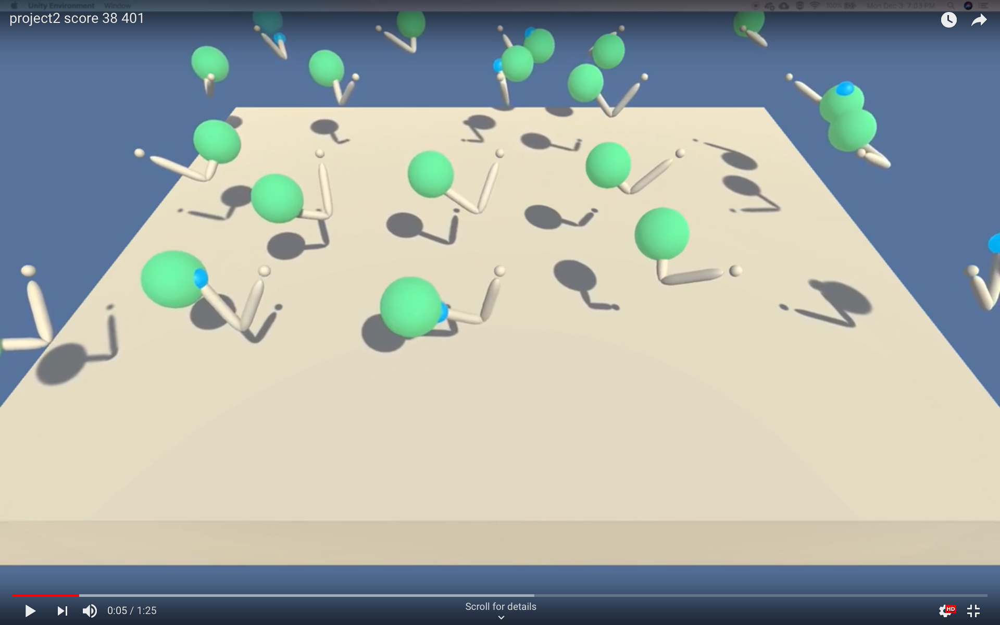

# Project 2: Continuous Control: Report

### 1. Introduction

For the second project of the Udacity Deep Reinforcement Learning Class, the goal was to use policy-based methods to solve an environment with a continuous action space. In policy-based methods, the objective is to directly find the optimal policy without first finding the optimal action-value function.

The environment that had to be solved consisted of twenty agents. Each agent was a double-jointed arm, and the objective was to have the agents hand be at a specific target location. Each agent had a corresponding state, and the state consisted of 33 vaiables including the agents position, rotation, velocity, and angular velocities.

The actions available were a vector of four numbers, corresponding to torque applied to the agents two joints. 

The rewards were setup such that for each timestep that the agents hand were inside the target location, the agent receives a reward of +0.1. To "solve" the environment, the goal was to have an average reward of +30 over the previous 100 episodes. This is averaged over all 20 agents.

### 2. Deep Deterministic Policy Gradient (DDPG)
DDPG is a policy-based method which tries to directly find the optimal policy without first trying to find the optimal action-value function. Furthermore, DDPG is able to deal with a continuous action-space. At some level, DDPG is closer to Deep Q-Learning than being a action-critic method, with a major improvement over Deep Q-Learning being that it can deal with a continuous action-space.

The DDPG learning method is setup as follows: 
DDPG uses two neural networks
- An "actor neural network" determines the best action for any given state.
- A "critic neural network" evaluates the optimal action-value function by using the actors best believed action.

DDPG reuses some of the strategies that were used with Deep Q-Learning. Two of the more important ones are the following:
1. Experience replay
2. Fixed Q-targets

In the case of experience replay, the agent generates an experience pool, and randomly samples from it to use for the learning. As the agent learns, the experience pool gets updated, and the agent continues randomly sampling from it.

DDPG does not really use Fixed Q-targets (as it does not calculate Q-values like Deep Q-Learning does), but the same idea is used. With DDPG, the algorithm keeps two copies of weights for both the actor and the critic network. These copies are called the regular network and the target network. The regular network is the most up-to-date network that is used for training, whereas the target network is used to stabilize the learning process. The target network on the other hand is used to calculate the losses by which the updates are made to the regular network.

For the regular and target networks, DDPG adds what is called "soft updates" over the update process used in Deep Q-Learning. In Deep Q-Learning, it was setup in such a way that every C steps the regular network overwrites the target network to get a new target network. With soft updates, instead of making an update every C steps, the target network is updated at every step by mixing in 0.01% of the regular weights into the weight of the target network. This has been proven to lead to faster convergence.

### 3. Neural network architecture and hyperparameters
Both the actor and critic neural networks had the same basic structure. The architecture of those are as follows.

The input to the neural network was the current state of the agent, which had a dimension of 33. The neural network had 3 layers, which each layer being fully connected. The details of the layers are as follows:
- Layer 1: Fully connected - 33 dimension input, 512 dimension output, Relu activation function
- Layer 2: Fully connected - 512 dimension input, 256 dimension output, Relu activation function
- Layer 3: Fully connected - 256 dimension input, 4 dimension output

For the output layer, in the case of the actor neural network, a tanh activation function was used. In the case of the critic neural network, an element-wise mean squared error loss was used to make the updates to the weights of the network.

Apart from this, the hyperparameters that were used were as follows:
- Buffer size: 100,000
- Batch size: 128
- Discouting factor: 0.99
- Actor Learning rate: 1e-4
- Critic Learning rate: 1e-4
- Maximum number of episodes: 2000
- Tau: 1e-3 - Tau is the parameter used for the soft-updates

### 4. Results
With the hyperparameters listed in the previous section, it took 33 episodes for the environment to be "solved". The table below provides the results of the learning.

### 5. Discussion of results
The video that is linked below shows agents running in the environment using checkpoints obtained after the environment was "solved". As can be seen in the video, all the agents do a very good job of being close to the target location. In the run shown, the 20 agents obtain an average score of 38.4, which is a very good score.  

### 6. Proposed Improvements
As DDPG has origins from DQN, it is theorized that the techniques that are proven to improve DQN should also lead to improvements for DDPG. Specifically, the "rainbow" techniques can be used, which consist of the following six modifications:
1. Double DQN
2. Prioritized experience replay
3. Dueling DQN
4. Learning from multi-step bootstrap targets
5. Distrobutional DQN
6. Noisy DQN

In addition, other actor-critic methods such as A2C and A3C should also be tried to compare the performance with DDPG.

### 7. Conclusion
I was able to successfully train agents using Deep Q-Learning. The first agent that was trained based on a commulative reward of 13 had issues where it often got stuck in an infinite loop, and would then obtain a very small commulative reward. This was mostly solved by training longer, and having an agent based on a commulative rewaard of 17, but that issue of infinite loop was still seen occasionally (althought it was very rare). To hopefully be able to completely solve this infinite loop issue, it was proposed that a prioritized experience replay should be used in the learning process.

### 8. References
Please note that the code used originates from the DDPG code that was provided in the Udacity Deep Reinforcement Learning class, and then modifcations were done to make it applicable for the specific environment that was solved. Similarly, some of the content of the README file originates from the Udacity Deep Reinforcement Learning class, as well as from my submission for the first project of this class.